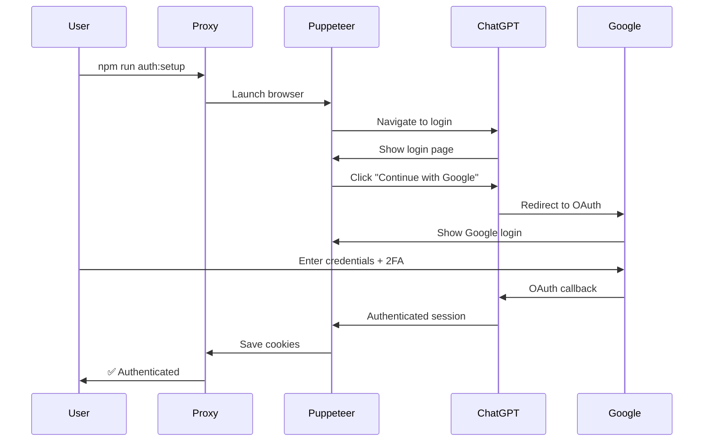

# Guide d'Authentification ChatGPT

## Vue d'ensemble

Ce projet utilise Puppeteer pour simuler l'authentification sur ChatGPT via Google OAuth. Les sessions sont persistées pour éviter de se reconnecter à chaque fois.

## Méthodes d'Authentification

### 1. Authentification Interactive (Recommandée) 🎯

C'est la méthode la plus fiable, surtout si vous avez la 2FA activée.

```bash
npm run auth:setup
```

Puis sélectionnez l'option 1. Un navigateur s'ouvrira et vous pourrez :
1. Cliquer sur "Continue with Google"
2. Entrer vos identifiants Google
3. Compléter la 2FA si nécessaire
4. Autoriser les permissions

### 2. Authentification Automatique

Si vous n'avez pas de 2FA, vous pouvez essayer l'authentification automatique :

```bash
npm run auth:setup
```

Sélectionnez l'option 2 et entrez vos identifiants. ⚠️ **Attention** : Cette méthode peut échouer avec la 2FA.

## Configuration

### Variables d'Environnement

Ajoutez dans votre `.env` :

```env
# Authentification ChatGPT
CHATGPT_EMAIL=votre-email@gmail.com  # Optionnel
CHATGPT_PASSWORD=                     # Ne pas stocker en production !
PUPPETEER_HEADLESS=false             # false pour voir le navigateur
SESSION_PERSIST=true                 # Sauvegarder la session
SESSION_PATH=./sessions/chatgpt      # Dossier des sessions
```

### Gestion des Sessions

Les sessions sont stockées dans `./sessions/chatgpt/` :
- `cookies.json` : Cookies de session
- `Default/` : Profil Chrome avec données persistantes

La session reste valide pendant plusieurs jours/semaines.

## Flow d'Authentification OAuth



## Utilisation dans le Code

### Service d'Authentification

```typescript
import { ChatGPTAuthService } from './services/chatgpt-auth.service';

const authService = ChatGPTAuthService.getInstance();

// Vérifier l'authentification
const isAuthenticated = await authService.authenticate();

if (isAuthenticated) {
  const page = authService.getPage();
  // Utiliser la page authentifiée
}
```

### Middleware Express

```typescript
app.use(async (req, res, next) => {
  const authService = ChatGPTAuthService.getInstance();
  
  if (!authService.isLoggedIn()) {
    const success = await authService.authenticate();
    if (!success) {
      return res.status(401).json({
        error: 'ChatGPT authentication required. Run: npm run auth:setup'
      });
    }
  }
  
  next();
});
```

## Résolution des Problèmes

### Erreur : "Google login button not found"

**Solution** : ChatGPT peut avoir changé son interface. Vérifiez les sélecteurs dans `chatgpt-auth.service.ts`.

### Erreur : "2FA required - manual intervention needed"

**Solution** : Utilisez l'authentification interactive (option 1) avec `headless: false`.

### Session expirée

**Solution** : Relancez `npm run auth:setup` pour vous reconnecter.

### Erreur : "TimeoutError: Navigation timeout"

**Causes possibles** :
1. Connexion internet lente
2. ChatGPT down ou maintenance
3. Blocage par Cloudflare

**Solution** : Augmentez les timeouts ou réessayez plus tard.

## Sécurité

### ⚠️ Importantes Recommandations

1. **Ne jamais commiter les credentials** :
   ```bash
   # .gitignore
   .env
   sessions/
   *.session
   cookies.json
   ```

2. **Utiliser des comptes dédiés** : Créez un compte Google spécifique pour le bot

3. **Rotation des sessions** : Renouvelez régulièrement les sessions

4. **Logs sensibles** : Assurez-vous que les logs ne contiennent pas de données sensibles

5. **Production** : En production, utilisez des secrets managers (AWS Secrets, Vault, etc.)

## Détection et Contournement

ChatGPT/OpenAI peut détecter l'automatisation. Voici nos stratégies :

### 1. Stealth Mode
- Puppeteer Stealth Plugin activé
- User-Agent réaliste
- Viewport standard
- WebDriver property masqué

### 2. Comportement Humain
- Délais aléatoires entre actions
- Mouvements de souris simulés
- Typing avec délais variables

### 3. Session Persistence
- Réutilisation des sessions
- Cookies persistants
- Profile Chrome sauvegardé

## Limitations

1. **Rate Limiting** : ChatGPT a des limites (environ 50 messages/3h pour GPT-4)
2. **Captcha** : Peut apparaître si comportement suspect
3. **Maintenance** : ChatGPT peut être down
4. **Changements UI** : L'interface peut changer

## Tests

### Tester l'Authentification

```bash
# Test script
npm run auth:test
```

### Vérifier la Session

```typescript
// src/scripts/test-auth.ts
const authService = ChatGPTAuthService.getInstance();
const isValid = await authService.checkExistingSession();
console.log('Session valid:', isValid);
```

## Alternatives

Si l'authentification OAuth pose problème :

1. **API Keys** : Utilisez directement l'API OpenAI avec une clé
2. **Proxy inversé** : Utilisez un service comme Cloudflare Workers
3. **Browser Extension** : Créez une extension qui intercepte les requêtes

## Support

Pour les problèmes d'authentification :
1. Vérifiez les logs dans `./logs/`
2. Testez avec `headless: false` pour voir ce qui se passe
3. Consultez la documentation Puppeteer
4. Ouvrez une issue sur le repo